# 1.

## 一、计算机视觉概述

### 1.计算机视觉发展

- 最早的历史可以追溯到中国古代的小孔成像
- 现代计算机视觉的发展历史与相机发展有关
- 1966 MIT 马文·明斯基的学生实现了PC链接摄像机
- 1982 马尔发布了《视觉》标志着计算机视觉正式成为一门学科
- 1999 David Lowe发表了SIFT特征相关论文
- 2001 发表了基于HAAR特征相关论文
- 2005 HOG特征提取的行人检测算法提出
- 2006 Pascal VOC数据集发布

- 2012 AletNet模型赢得ImageNet图像分类比赛冠军
- 深度学习在视觉领域开始流行起来

### 2.主要应用场景

- 自动驾驶/辅助驾驶
- 机器视觉- AI+机构/工业质检智能
- 安防监控-人脸识别/火灾监控/异常监控
- ......

### 3.计算机视觉框架

#### 1).传统计算机视觉框架

- 1970 Matlab，作为数据处理工具箱，后期支持图像处理
- 1993 Matrox mil，发布第一个版本
- 1996 Halcon，发布
- 1999 启动，2006发布1.0版本 Open CV，开源
- 2009 Vision Pro，发布

#### 2).深度学习计算机视觉框架

- Caffe
- Tensorflow
- Pytorch
- Paddlepaddle
- Keras

上面重要是模型训练，下面主要是模型部署

- OpenVINO
- TensorRT
- onnxruntime
- Deepface
- YOLO/DarkNet
- mmdetection
- Paddle-detection/seg/ocr

当前业界主流框架如下

- 机器视觉方向

Halcon/VisionPro/Mil/OpenCV

- 深度学习方向

tensorflow/pytorch/paddlepaddle + openvino/tensorRT/onnxruntime

- 主流语言

python/c++

#### 3).计算机视觉框架的未来趋势

- 低代码平台流行趋势明显
- 传统视觉跟深度学习整合趋势明显
- 算法设计流程化/可视化
- 算法模块易用性/通用性
- 计算资源异构化支持趋势
- 深度学习模型训练简捷化

更远一点

- 无代码化
- 算法设计流程可视化
- 导出部署支持多种语言
- 计算资源支持异构化
- 算法model zoo丰富化，本地与云端
- 开发者都可以贡献算法


## 二、OpenCV框架

OpenCV框架是开源的，可免费商用的一个不错的框架

### 1.OpenCV简介

#### 1).发展历史

- 在1999年开始开发

- 2006年 OpenCV1.0发布

    c语言为接口，对算法工程师不友好，存在大量内存泄露问题

- 2009年 OpenCV2.0发布

    转换为c++接口，解决上面的问题

- 2012年 社区托管模式

- 2015年 OpenCV3.0发布

- 2018年 OpenCV4.0发布

- 2022年4月 OpenCV4.5.5发布

#### 2).框架结构


#### 3).源码与教程

- 源码

    GitHub: https://github.com/opencv

- 官方教程支持C++/Python

- Python有两个库

    - Opencv-python 包含传统模块内容
    - Opencv-contrib-python 包含了扩展部分

- 安装

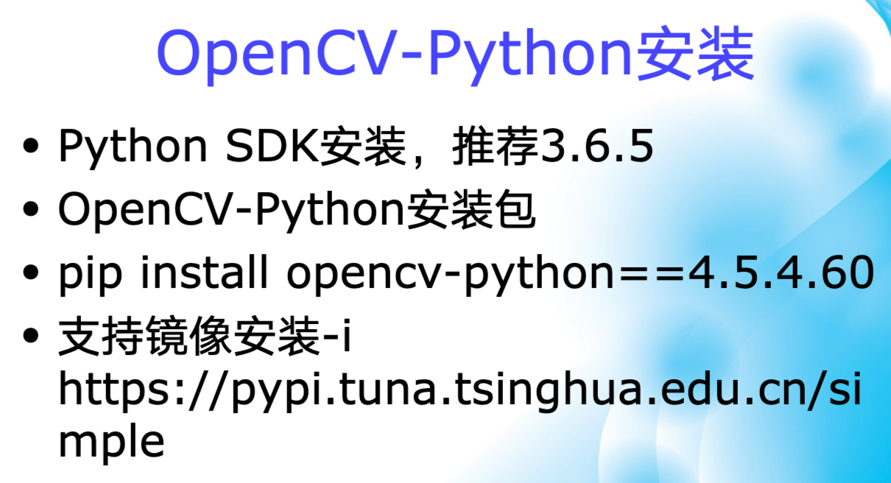


### 2.初步学习

这里记录一下OpenCV基础学习部分

#### 1).图像的读取与显示

- 图像理解

    人眼看到的是真实的图像，而计算机看到的是矩阵

    灰度图像 - 单通道

    彩色图像 - 三通道

    opencv 读取彩色图像的通道顺序是BGR

- 图像的读取与显示

    ```python
    # 图像读取
    cv.imread(filename[,flags]) -> retval
    	- filename 表示文件路径
    	- []内的参数表示可选，可以不填
    # 图像显示
    cv.imshow(winname,mat) -> None
    	- winname 表示窗口标题(不支持中文标题)
    	- mat 表示图像矩阵
    # 图像等待
    cv.waitKey(0)
    	- 表示一直等待，直到任意一个键盘操作
    cv.waitKey(1000)
    	- 表示等待1000毫秒
    # 注意如果没有上面的等待，是看不到图像显示的，一下子就消失了
    ```

    ```python
    import cv2 as cv 
    import numpy as np 
    
    def image_show(path,winname = 'oepncv_learn'):
        image = cv.imread(path)
        cv.imshow(winname,image)
        cv.waitKey(0)
    
    def main():
        file = '../data/beauty.png'
        image_show(file,'beauty')
    
    if __name__ == "__main__":
        main()
    ```


#### 2).图像色彩空间转换

- 图像色彩空间

    人人眼的可见光区域 紫外 可见光 红外

    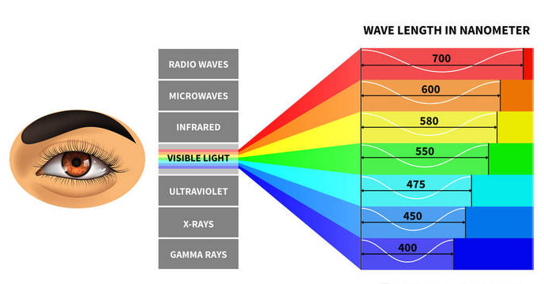

-  opencv中常用的色彩空间

    详细介绍可以看知乎文章 https://zhuanlan.zhihu.com/p/95952096

    HSV/RGB/YCrCb

     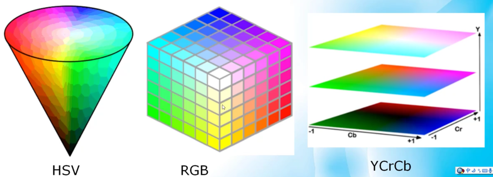

> RGB色彩空间，设备独立
>
> HSV色彩空间，对计算机友好，区分各种色彩
>
> YCrCb，Y分量表示信息，CrCb可以被压缩
>
> RGB是计算机显示器的标准支持色彩系统
>
> RGB的取值范围0-255
>
> HSV的取值范围，H：0-180，SV：0-255

- 色彩空间转换

    ```python
    cv.cvtColor(src,code[,dst[,dstCn]]) -> dst
    - src表示输入图像，类型CV_8U/CV_32F
    - code表示转换形式
    		枚举类型
      	cv::COLOR_BGR2RGB = 4
        cv::COLOR_BGR2GRAY = 6
        cv::COLOR_GRAY2BGR = 8
        cv::COLOR_BGR2HSV = 40
        cv::COLOR_HSV2BGR
    -注意，灰度图与彩色图之间转换，通道数是可以转换回来的，但是信息有丢失，灰度图转成彩色图还是灰度图；BGR与HSV都是三通道，灭有问题
    ```

    ```python
    def color_space_transfor(path):
        img = cv.imread(path)
        cv.imshow('BGR',img)
        hsv_img = cv.cvtColor(img,cv.COLOR_BGR2HSV)
        ycrcb_img = cv.cvtColor(img,cv.COLOR_BGR2YCrCb)
        cv.imshow('HSV',hsv_img)
        cv.imshow('YCRCB',ycrcb_img)
        cv.waitKey(0)
        cv.destroyAllWindows()
    ```

    

#### 3).图像对象的创建与赋值

- 图像对象属性

    | 符号        | 含义                                                         |
    | ----------- | ------------------------------------------------------------ |
    | image.shape | 图像的shape，包含宽、高、通道数(如果只有一个通道，就是宽、高) |
    | image       | 图像深度(例RGB，一个像素RGB三个值，一个值是一个字节8bit，所以图像深度为24) |
    | image.dtype | 图像数据类型                                                 |

    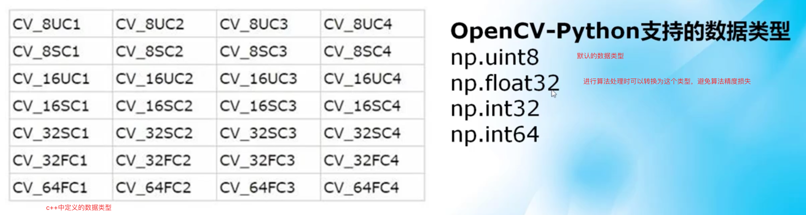

- numpy常用函数

    **opencv-python中一切图像数据皆numpy array**

    这里会去学习记录numpy知识**TODO**

- 图像对象创建与赋值 

    创建图像就是创建numpy array

    创建图像最常用的函数：

    ```
    np.zeros -> 创建一个黑色背景图像
    np.zeros_like -> 创建一个与输入图像大小一致的黑色背景图像
    np.ones -> 创建一个全部像素值为1的图像
    ```

    ```python
    def image_create():
        img = np.zeros((3,3,3),dtype=np.uint8)
        cv.imshow('black',img)
        img[:] = 255
        cv.imshow('white',img)
        img[:] = (255,0,0)
        cv.imshow('blue',img)
        cv.waitKey(0)
        cv.destroyAllWindows()
    ```

    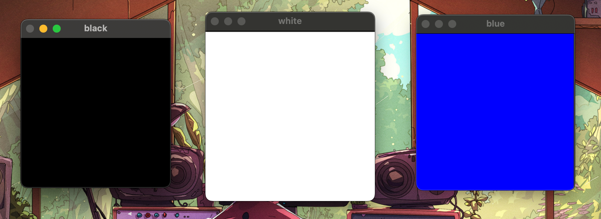

    下面是一个小练习，看代码与图像即可

    ```python
    def image_red_blue():
        img = np.zeros((512,512,3),dtype=np.uint8)
        cv.imshow('black',img)
        img[:,:256] = (0,0,255)
        img[:,256:] = (255,0,0)
        cv.imshow('red_blue',img)
        cv.waitKey(0)
        cv.destroyAllWindows()
    ```

    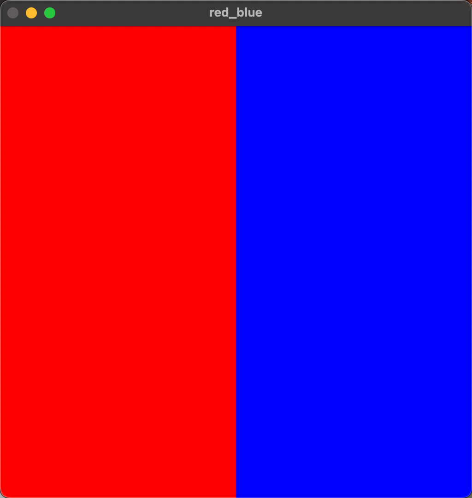

    注意：numpy的切片操作与list不同，如果是多维的，是在[]中间添加','分隔

#### 4).图像像素的读写操作

- 像素与分辨率

    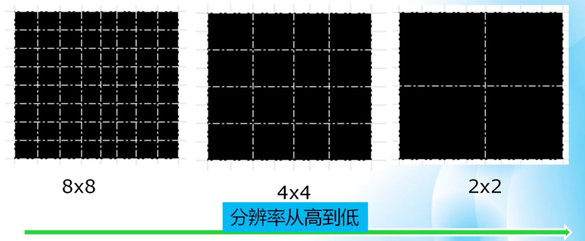

    > dpi:每英寸的点数目，主要针对打印
    >
    > ppi:每英寸的像素数目，主要针对图像

- opencv中的像素

    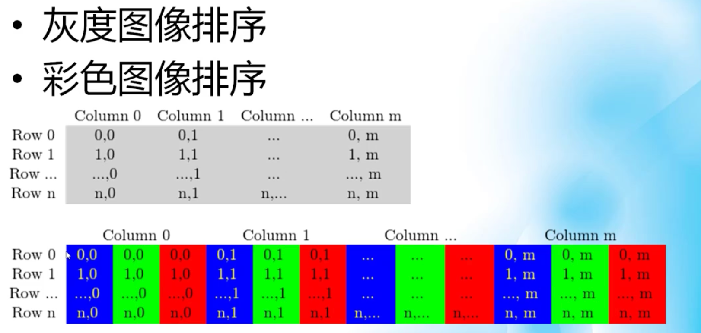

- 像素的访问与遍历

    其实就是访问numpy数组

    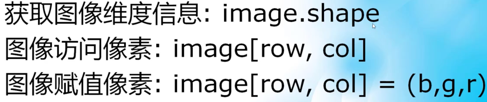

    

    小练习：图像色彩反转

    ```python
    def image_inverse(path):
        img = cv.imread(path)
        cv.imshow('normal',img)
        h, w, c = img.shape
        for i in range(h):
            for j in range(w):
                b, g, r = img[i,j]
                print(i,b,g,r)
                img[i,j] = (255 - b, 255 - g, 255 - r)
        cv.imshow('inverse',img)
        cv.waitKey(0)
        cv.destroyAllWindows()
    ```

    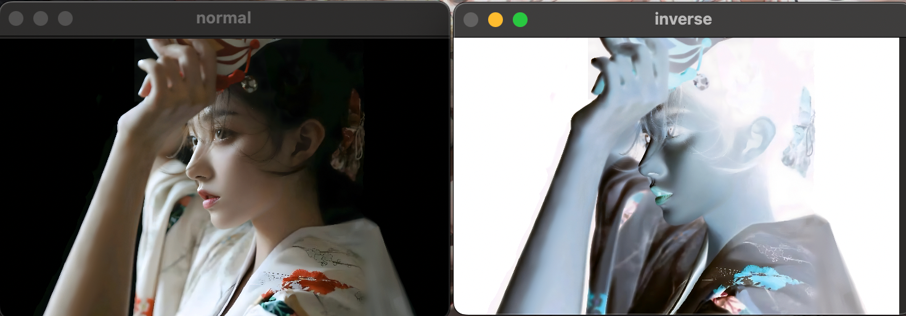

#### 5).图像的算数操作

图像进行算法操作的前提：图像大小与通道数一致

算数操作包括：加法、减法、乘法、除法；就是B/G/R对应的值的算数操作

- 加法

    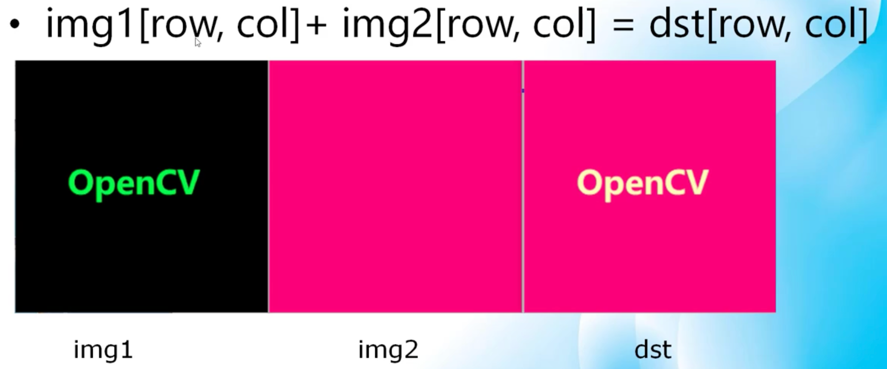

- 减法

    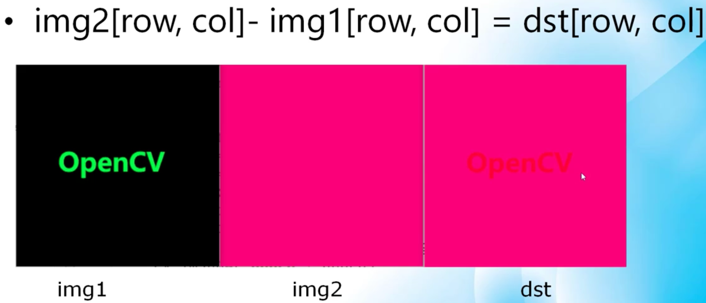

- 乘法

    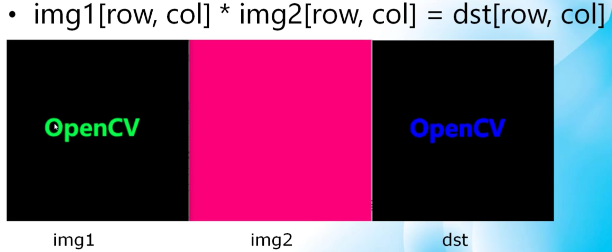

- 除法

    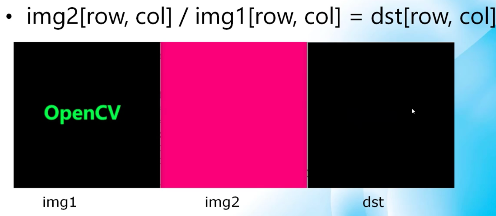


opencv中已经集成好了响应的函数

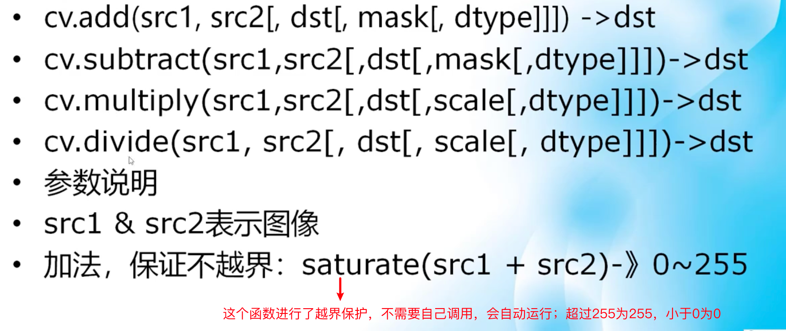

**mask参数**

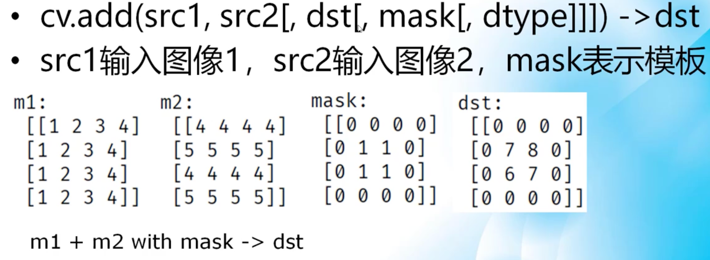

对mask中非0区域进行算数运算，0区域为mask中的值；通过设置不同的mask，就可以获取ROI区域(感兴趣区域 (**ROI**) )

```python
def image_calculate(path):
    img = cv.imread(path)
    cv.imshow('normal',img)
    img1 = np.zeros_like(img)
    mask = np.zeros_like(img)
    mask[1000:3000,2000:4000] = 1
    dst = cv.add(img,img1,mask=mask)
    cv.imshow('add_mask',dst)
    cv.waitKey(0)
    cv.destroyAllWindows()
```

