西瓜书的使用方法：

1. 初学机器学习的第一本书：

​	通读、速读；细节不懂处略过

​	了解机器学习的疆域和基本思想，理解基本概念，“观其大略”

2. 阅读其他关于机器学习具体分支的读物(三个月、半年)
3. 再读、对“关键点”的理解，理解技术细冗后的本质，升华认识，“提纲挈领”
4. 对机器学习多个分支有所了解(1-3年)
5. 再读、细想，不同内容的联系，不同的描述方式，出现位置蕴含的意义，个别字句的启发可能是自行摸索数年不易得，“疏通经络”

# 一、绪论

## 1.认知

### 1).科学技术工程应用

科学：是什么，为什么

技术：怎么做

工程：做得多快好省

应用：应用这个技术

### 2).机器学习

经典定义：利用经验改善系统自身的性能【1997】

利用计算机，需要把经验替换为数据，目前机器学习主要研究智能数据分析的理论和方法，并已成为智能数据分析技术的主要源泉之一

- 计算学习理论

    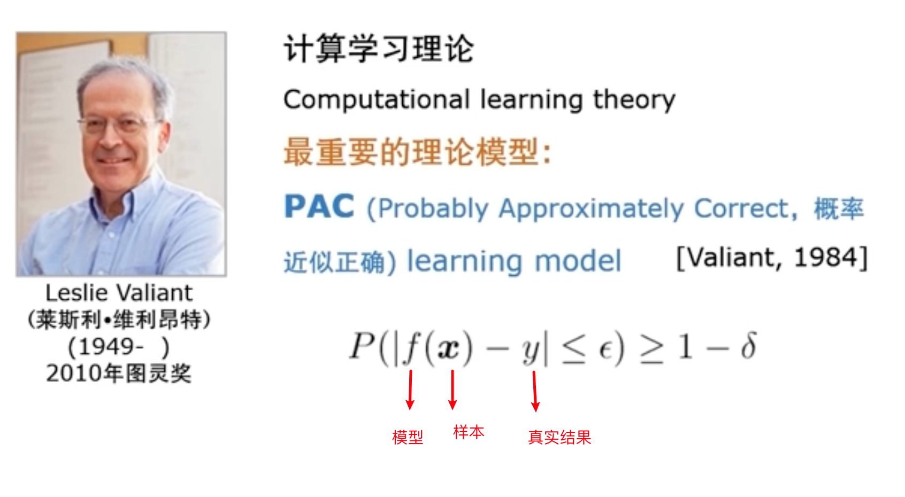

- 基本术语

    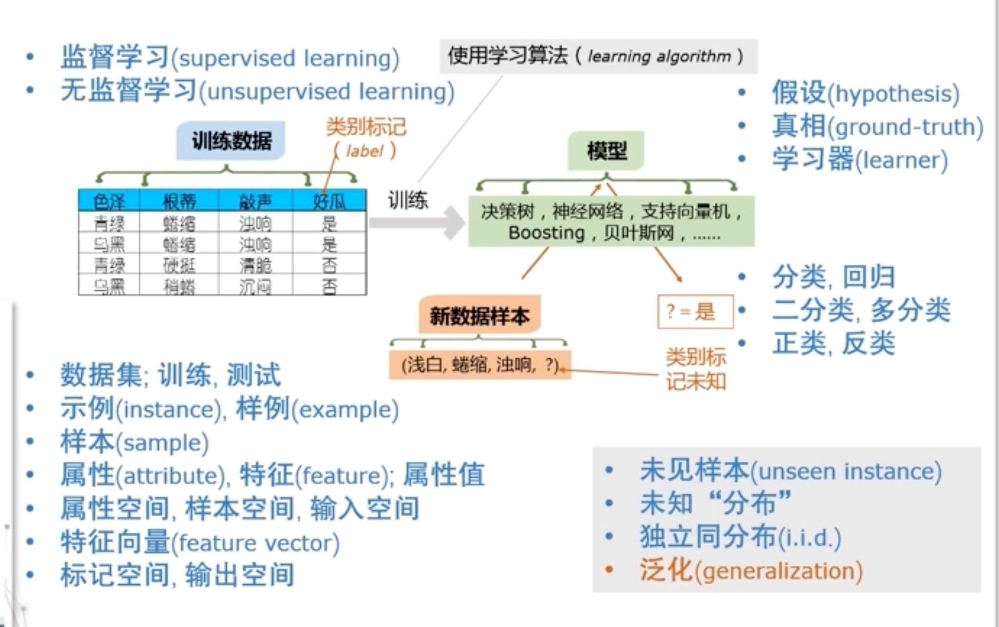

    - 示例：不带结果的一个样本

        样例：带结果的一个样本

    - 假设：模型得到的结果

        真相：真实的结果

    - 二分类是最基础的一个问题，多分类可以转换为二分类

    - 监督学习：数据集中有结果，有类别标记；主要应用于分类，回归

        无监督学习：数据集中没有类别标签；主要应用于聚类(将数据分为几堆)

    - 机器学习的假设，假设所有数据都是在一个规律下(未知分布)，通过对部分数据进行规律总结，去预测未见样本；这里的数据有一个重要的假设，独立同分布，这样才可以应用概率统计理论去预测

    - 泛化：处理新数据的能力，处理新数据的能力越好，泛化能力越好

    - 如何突破独立同分布假设，是目前机器学习最前沿的研究之一

- 归纳偏好

    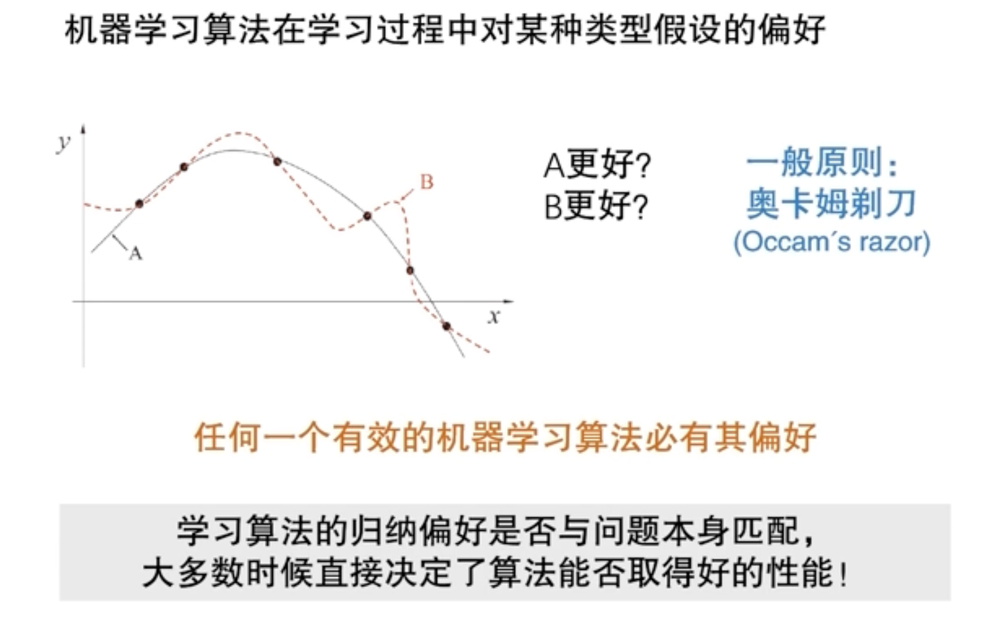

    在现有数据中，有多个模型解释了这个现象，如何选择？

    奥卡姆剃刀准则：若非必要，勿增实体

    机器学习中一般情况下，选择最简单的，更平滑的(smoth)，如何判断哪个模型简单这个问题并不简单，最终选择哪个算法模型，还是要看这个算法的假设与数据合适
    
- NFL定理

    No Free Lunch 

    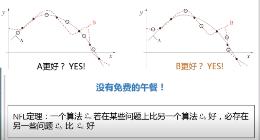

    脱离具体问题，空泛讨论“什么学习算法更好”毫无意义！最佳方案：**按需设计，度身定制**

    

## 2.模型评估与选择

### 1).泛化能力

要知道最终结果需要什么，就给什么；评价模型好坏的一个方面是**泛化能力强**，能更好的使用于未知数据(unseen instance)

### 2).过拟合/欠拟合

泛化误差：在“未来”样本上的误差

经验误差：在训练集上的误差，亦称“训练误差”

过拟合(overfitting)/欠拟合(underfitting)

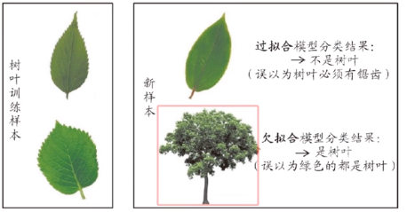

目前并不能解决过拟合问题，只能是缓解；不同的算法有不同的机制，学习的时候可以注意一下，该机制何时失效

### 3).三大问题

模型的选择，在没有未知数据的情况下，该如何判断？

- 如何获得测试结果 ？ -> 评估方法
- 如何评估性能优劣？ -> 性能度量
- 如何判断实质差别？ -> 比较检验

### 4).评估方法

关键：怎么获得“测试集”

常见方法：

- 留出法(hold-out)

    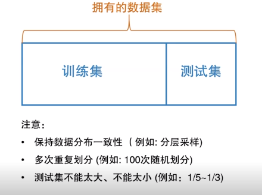

    分层取样：训练集与测试集中“好瓜”与“坏瓜”数量要相当

    多次重复划分取平均值，保证划分的影响

    最终选择好算法后，应该将全部数据当作训练集来得到最后的模型

- 交叉验证法(cross validation)

    上面的方法在进行训练或着测试时，由于随机划分可能存在某个数据没有用到

    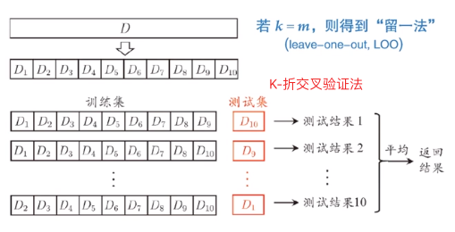

- 自助法(bootstrap)

    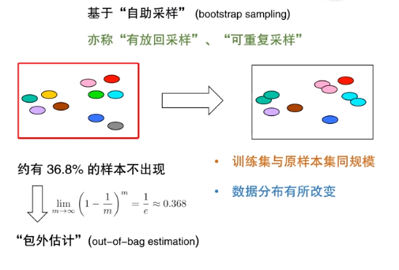

    当数据量很小或者数据分布改变影响很小时，这种方法很好用

### 5).调参与验证集

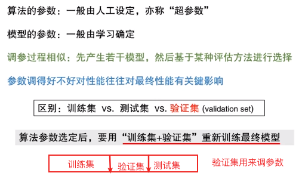

### 6).性能度量

主要分为两类问题，回归与分类

- 回归

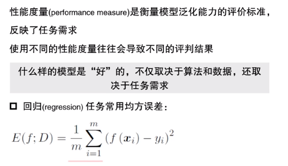

- 分类

    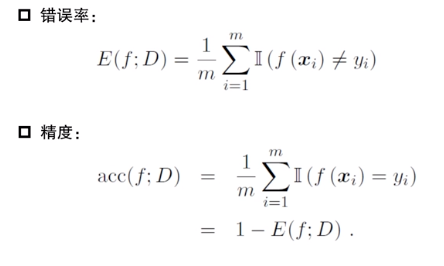

    

###  

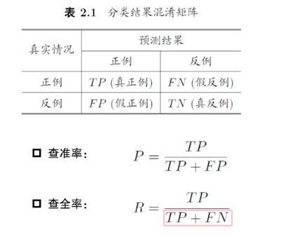

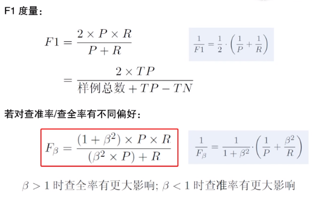

### 7).比较检验

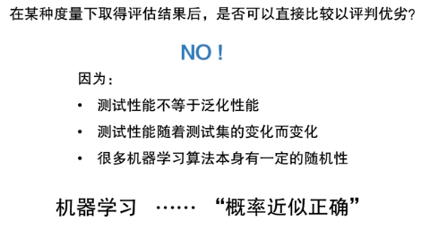

检验方法：

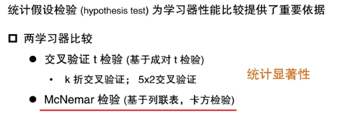